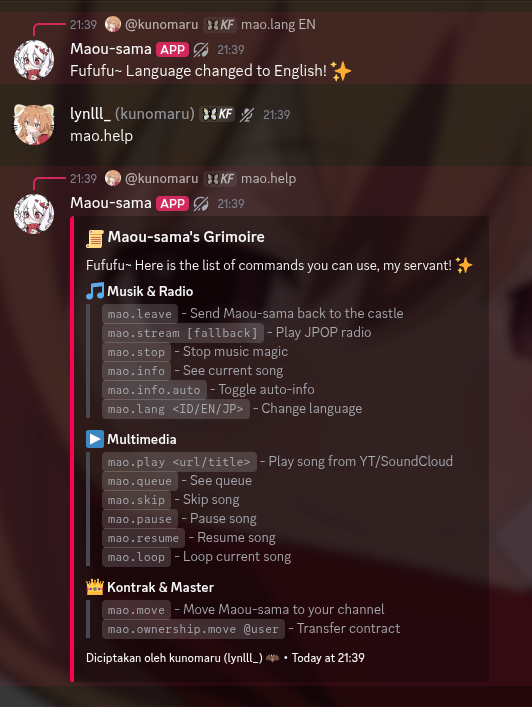
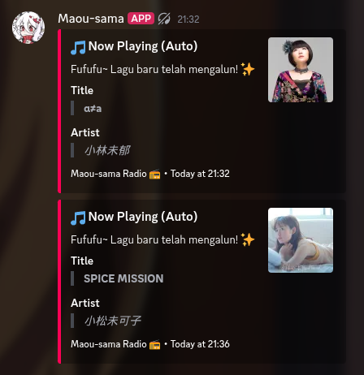

<h1>Maou-bot</h1>

<sub><b>A simple and lightweight Discord music bot</b><br>
Featuring YouTube/SoundCloud playback and 24/7 JPOP radio.</sub>

<br>

<br><br>

<b>Screenshots</b><br>


<br><br>

<b>Features</b>
-  Play music from YouTube and SoundCloud
-  24/7 JPOP Radio streaming via listen.moe
-  Multi-language support (English, Indonesian, Japanese)
-  Session ownership system

<br>

<b>Prerequisites</b>
- Node.js (v18 or higher)
- FFmpeg (required for audio playback)

<br>

<b>Getting Started</b>

You can either invite the hosted bot to your server or host it yourself.

<b>Option 1: Invite to Server</b>
[Click here to invite Maou-bot to your Discord server](https://discord.com/oauth2/authorize?client_id=1526849354655076504&permissions=36785152&integration_type=0&scope=bot)

<b>Option 2: Self-Host</b>

1. Clone the repository:
```bash
git clone https://github.com/kumoruBaka/Maou-bot.git
cd Maou-bot
```

2. Install dependencies:
```bash
npm install
```

3. Create a `.env` file and add your token:
```env
TOKEN=your_discord_bot_token_here
```

<br>

<b>Usage</b>

Start the bot:
```bash
npm start
```
And done, ready to use

<br>

<b>Commands</b>

Prefix: `mao.`

- `mao.play <url/title>` - Play a song from YouTube or SoundCloud
- `mao.stream` - Play listen.moe JPOP radio
- `mao.stop` - Stop playback and clear queue
- `mao.skip` - Skip the current song
- `mao.pause` / `mao.resume` - Pause or resume playback
- `mao.loop` - Toggle loop for the current song
- `mao.queue` - Show the current music queue
- `mao.lang <ID/EN/JP>` - Change bot language
- `mao.help` - Show all available commands

<br>

<b>License</b>

[MIT](LICENSE)

<br>

<b>Credits & Acknowledgments</b>
- Unofficial listen.moe stream bot made by kunomaru.
- Radio stream and API provided by the [LISTEN.moe](https://listen.moe/) team.
- Inspired by the official [LISTEN-moe/discord-bot](https://github.com/LISTEN-moe/discord-bot).

<br>

<b>Contributors</b>
- [kunomaru (discord: lynlll_)](https://github.com/kumoruBaka) - Creator & Developer
